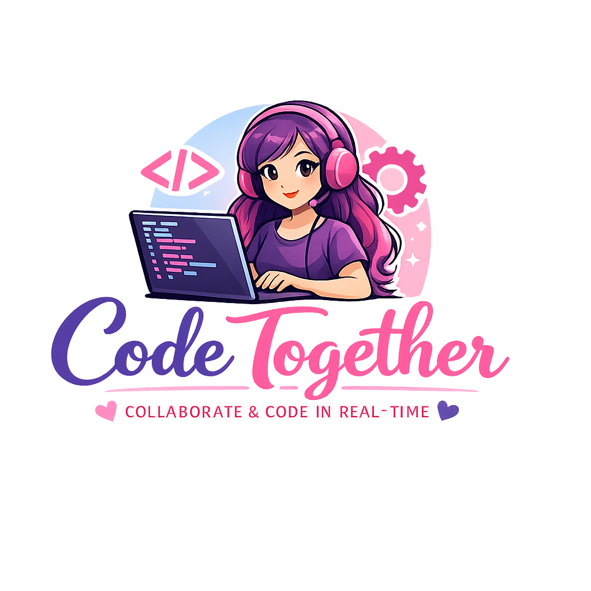

<div align="center">



# SheCode — Real-Time Collaborative Code Editor

**Write code together. Sketch ideas together. No setup needed.**

[](https://your-app.vercel.app)
[](https://your-render-service.onrender.com/health)
[](https://github.com/darkiratk7284/realtime-editor/stargazers)
[](LICENSE)

</div>

---

## ✨ Features

| Feature | Description |
|---|---|
| 🚀 **Real-Time Code Sync** | Every keystroke is instantly shared across all room members |
| 🎨 **Shared Whiteboard** | Collaborative canvas for sketching diagrams and ideas |
| 👥 **User Presence** | See who's in your room with live avatars |
| ✍️ **Typing Indicators** | Know when a teammate is typing |
| 🔗 **Shareable Room Links** | Create a room and share the ID — no account needed |
| 💾 **Session Persistence** | Late joiners receive the current code & board state |
| 📱 **Responsive Layout** | Works on desktop and tablet |

---

## 🏗️ Architecture

```
┌────────────────────────────────────────────────────────┐
│                        Browser                         │
│                                                        │
│  React App (Vercel)  ←──WebSocket──→  Node.js Server  │
│  • Home page                           (Render)        │
│  • Editor page                       • socket.io       │
│  • Whiteboard                        • room state      │
└────────────────────────────────────────────────────────┘
```

**Stack:**
- **Frontend:** React 19, React Router, CodeMirror 6, Socket.IO Client
- **Backend:** Node.js, Express, Socket.IO
- **Hosting:** Vercel (frontend) + Render (backend WebSocket server)

---

## 🚀 Quick Start — Local Development

### Prerequisites
- Node.js ≥ 18
- npm ≥ 9

### 1 — Clone the repo
```bash
git clone https://github.com/darkiratk7284/realtime-editor.git
cd realtime-editor
```

### 2 — Install dependencies
```bash
npm install
```

### 3 — Configure environment
```bash
cp .env.example .env
# .env is already set to localhost — no changes needed for local dev
```

### 4 — Start the backend (Socket.IO server)
```bash
npm run server:dev     # with auto-reload via nodemon
```

### 5 — Start the frontend (new terminal)
```bash
npm start              # opens http://localhost:3000
```

---

## 🌍 Deploy to Production

### Frontend → Vercel

[](https://vercel.com/new/clone?repository-url=https://github.com/darkiratk7284/realtime-editor)

1. Click the button above (or import manually at [vercel.com](https://vercel.com))
2. In **Settings → Environment Variables**, add:
   ```
   REACT_APP_BACKEND_URL = https://your-render-service.onrender.com
   ```
3. Deploy — Vercel builds with `npm run build` automatically

---

### Backend → Render

[](https://render.com/deploy?repo=https://github.com/darkiratk7284/realtime-editor)

1. Click the button above — `render.yaml` handles all configuration
2. In the Render dashboard, set the environment variable:
   ```
   CORS_ORIGIN = https://your-app.vercel.app
   ```
3. Done — the server starts with `node server.js`

> **Free tier note:** Render free services sleep after 15 minutes of inactivity.  
> The `/health` endpoint is configured so you can use [UptimeRobot](https://uptimerobot.com) to ping it every 5 minutes and keep it awake for free.

---

## ⚙️ Environment Variables

| Variable | Where | Description |
|---|---|---|
| `REACT_APP_BACKEND_URL` | Vercel | Full URL of your Render backend |
| `PORT` | Render | Port the server listens on (Render sets automatically) |
| `CORS_ORIGIN` | Render | Comma-separated list of allowed frontend origins |

---

## 📁 Project Structure

```
realtime-editor/
├── public/               # Static assets & HTML template
│   └── index.html        # SEO + Open Graph meta tags
├── src/
│   ├── components/
│   │   ├── Client.js     # User avatar card
│   │   ├── Editor.js     # CodeMirror 6 editor wrapper
│   │   └── Whiteboard.js # Canvas drawing component
│   ├── pages/
│   │   ├── Home.js       # Room join / create page
│   │   └── EditorPage.js # Main collaboration view
│   ├── Actions.js        # Socket event name constants
│   ├── Socket.js         # Socket.IO client initializer
│   └── App.js            # Router & toast config
├── server.js             # Socket.IO + Express server
├── render.yaml           # One-click Render deploy config
├── vercel.json           # SPA rewrites + security headers
├── .env.example          # Environment variable template
└── package.json
```

---

## 🤝 Contributing

Contributions are welcome! Here's how:

1. **Fork** the repository
2. **Create** a feature branch: `git checkout -b feature/amazing-feature`
3. **Commit** your changes: `git commit -m 'feat: add amazing feature'`
4. **Push**: `git push origin feature/amazing-feature`
5. **Open a Pull Request**

Please make sure to update tests and keep code style consistent.

---

## 📄 License

This project is licensed under the **MIT License** — see the [LICENSE](LICENSE) file for details.

---

<div align="center">

Built with 💜 by [Darkirat](https://github.com/darkiratk7284)

⭐ Star this repo if you found it useful!

</div>
